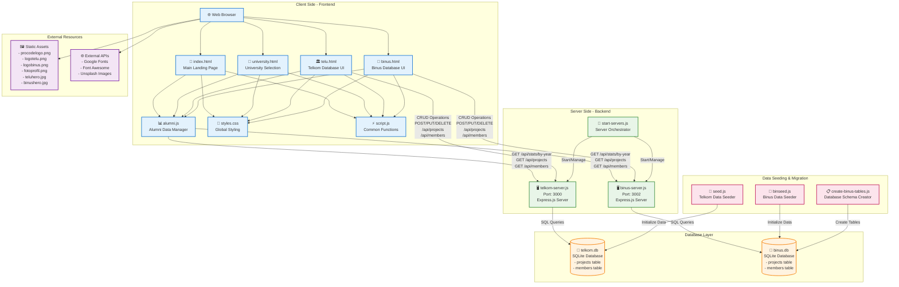
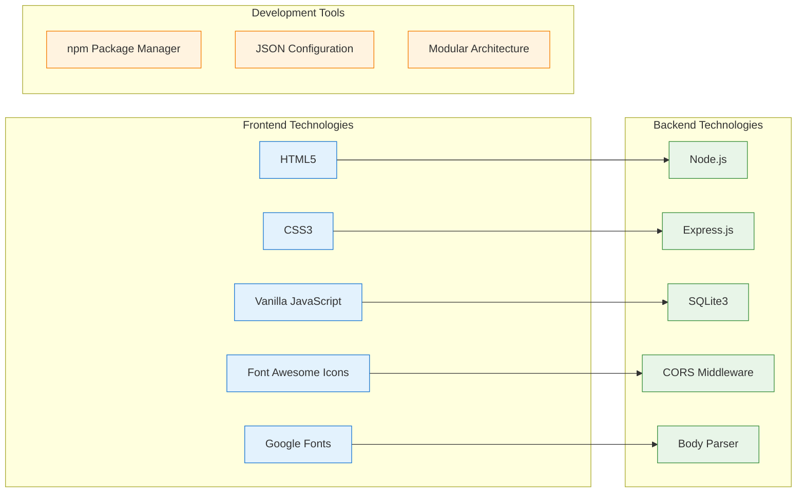
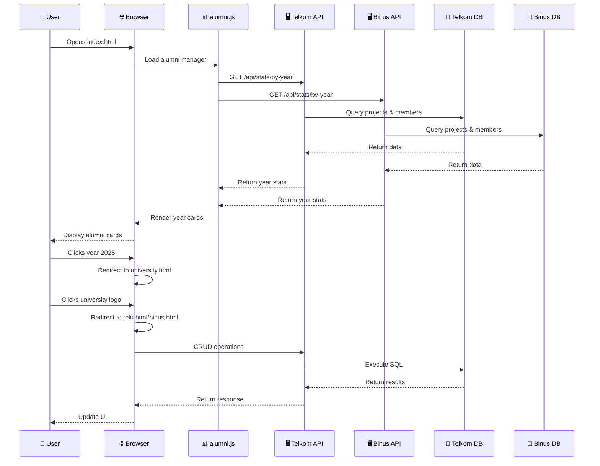
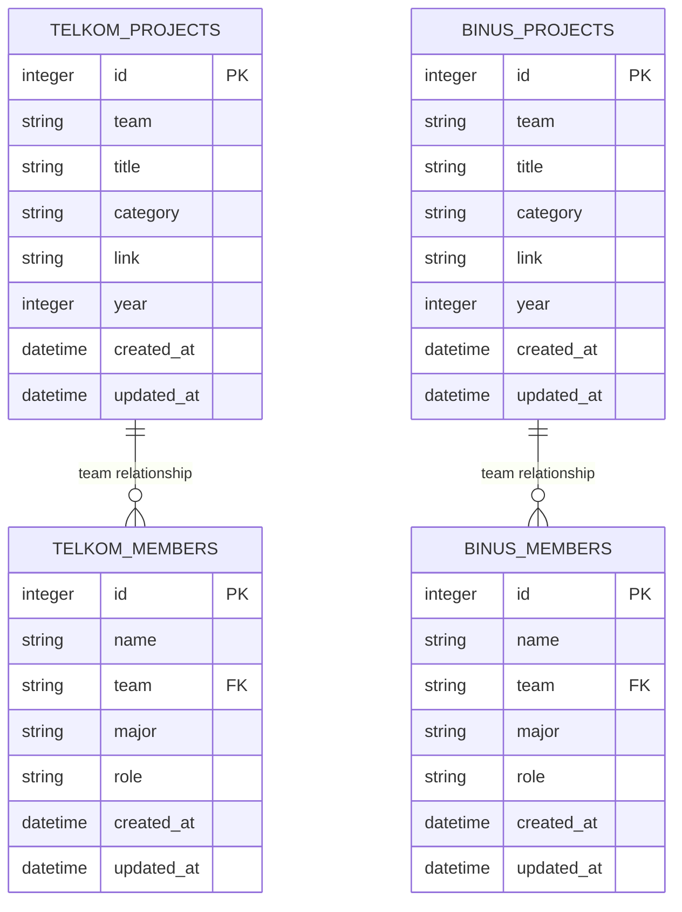
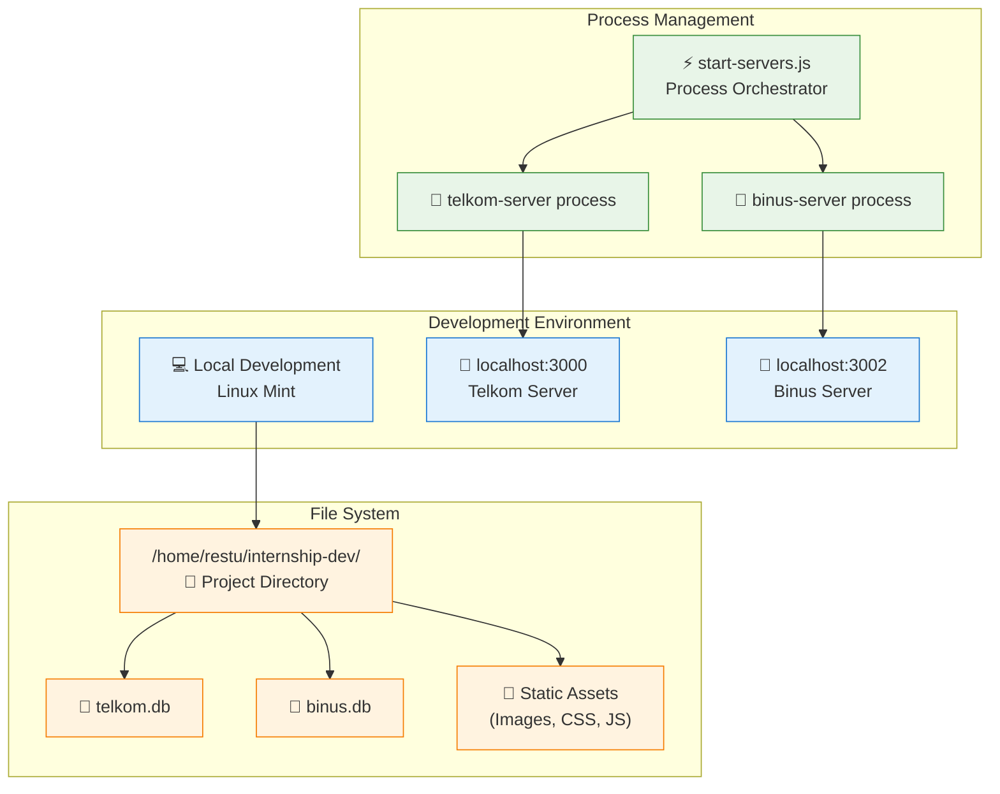

# Architecture Diagram - ProcodeCG Internship Alumni System

## 🏗️ System Architecture Overview

## 🔧 Technology Stack

## 📊 Data Flow Architecture

## 🏗️ File Structure & Dependencies

```mermaid
graph TD
    subgraph "Project Root"
        ROOT["/home/restu/internship-dev/"]
    end
    
    subgraph "Frontend Files"
        F1["index.html"]
        F2["university.html"] 
        F3["telu.html"]
        F4["binus.html"]
        F5["styles.css"]
        F6["script.js"]
        F7["alumni.js"]
    end
    
    subgraph "Backend Files"
        B1["telkom-server.js"]
        B2["binus-server.js"]
        B3["start-servers.js"]
        B4["server.js"]
    end
    
    subgraph "Database Files"
        D1["telkom.db"]
        D2["binus.db"]
        D3["seed.js"]
        D4["binseed.js"]
        D5["create-binus-tables.js"]
    end
    
    subgraph "Assets"
        A1["procodelogo.png"]
        A2["logotelu.png"]
        A3["logobinus.png"]
        A4["fotoprofil.png"]
        A5["teluhero.jpg"]
        A6["binushero.jpg"]
    end
    
    subgraph "Config Files"
        C1["package.json"]
        C2["node_modules/"]
    end

    ROOT --> F1
    ROOT --> F2
    ROOT --> F3
    ROOT --> F4
    ROOT --> F5
    ROOT --> F6
    ROOT --> F7
    ROOT --> B1
    ROOT --> B2
    ROOT --> B3
    ROOT --> B4
    ROOT --> D1
    ROOT --> D2
    ROOT --> D3
    ROOT --> D4
    ROOT --> D5
    ROOT --> A1
    ROOT --> A2
    ROOT --> A3
    ROOT --> A4
    ROOT --> A5
    ROOT --> A6
    ROOT --> C1
    ROOT --> C2

    classDef frontend fill:#e3f2fd,stroke:#1976d2
    classDef backend fill:#e8f5e8,stroke:#388e3c
    classDef database fill:#fff3e0,stroke:#f57c00
    classDef assets fill:#fce4ec,stroke:#c2185b
    classDef config fill:#f3e5f5,stroke:#7b1fa2

    class F1,F2,F3,F4,F5,F6,F7 frontend
    class B1,B2,B3,B4 backend
    class D1,D2,D3,D4,D5 database
    class A1,A2,A3,A4,A5,A6 assets
    class C1,C2 config
```

## 🔌 API Architecture

```mermaid
graph TB
    subgraph "Telkom API Endpoints (Port 3000)"
        T1["GET /api/projects<br/>📋 Get all projects"]
        T2["POST /api/projects<br/>➕ Create project"]
        T3["PUT /api/projects/:id<br/>✏️ Update project"]
        T4["DELETE /api/projects/:id<br/>🗑️ Delete project"]
        T5["GET /api/members<br/>👥 Get all members"]
        T6["POST /api/members<br/>➕ Create member"]
        T7["PUT /api/members/:id<br/>✏️ Update member"]
        T8["DELETE /api/members/:id<br/>🗑️ Delete member"]
        T9["GET /api/stats/by-year<br/>📊 Get statistics"]
    end

    subgraph "Binus API Endpoints (Port 3002)"
        B1["GET /api/projects<br/>📋 Get all projects"]
        B2["POST /api/projects<br/>➕ Create project"]
        B3["PUT /api/projects/:id<br/>✏️ Update project"]
        B4["DELETE /api/projects/:id<br/>🗑️ Delete project"]
        B5["GET /api/members<br/>👥 Get all members"]
        B6["POST /api/members<br/>➕ Create member"]
        B7["PUT /api/members/:id<br/>✏️ Update member"]
        B8["DELETE /api/members/:id<br/>🗑️ Delete member"]
        B9["GET /api/stats/by-year<br/>📊 Get statistics"]
    end

    subgraph "Frontend Consumers"
        UI1["🏛️ telu.html"]
        UI2["🏢 binus.html"]
        UI3["📊 alumni.js"]
    end

    UI1 --> T1
    UI1 --> T2
    UI1 --> T3
    UI1 --> T4
    UI1 --> T5
    UI1 --> T6
    UI1 --> T7
    UI1 --> T8

    UI2 --> B1
    UI2 --> B2
    UI2 --> B3
    UI2 --> B4
    UI2 --> B5
    UI2 --> B6
    UI2 --> B7
    UI2 --> B8

    UI3 --> T9
    UI3 --> B9

    classDef telkom fill:#e8f5e8,stroke:#388e3c
    classDef binus fill:#fce4ec,stroke:#c2185b
    classDef frontend fill:#e3f2fd,stroke:#1976d2

    class T1,T2,T3,T4,T5,T6,T7,T8,T9 telkom
    class B1,B2,B3,B4,B5,B6,B7,B8,B9 binus
    class UI1,UI2,UI3 frontend
```

## 🗄️ Database Schema

## 🚀 Deployment Architecture

## 📈 System Features & Capabilities

### **Core Features:**
- 🎯 **Multi-University Support**: Separate databases for Telkom & Binus
- 📊 **Dynamic Statistics**: Real-time data aggregation from multiple sources  
- 🔍 **Advanced Search**: Filter by category, team name, project title
- ⚡ **Real-time CRUD**: Instant database operations with UI feedback
- 📱 **Responsive Design**: Mobile-friendly interface
- 🎨 **Interactive UI**: Hover effects, animations, modal dialogs

### **Technical Highlights:**
- 🏗️ **Microservices Architecture**: Independent servers per university
- 🔄 **API-First Design**: RESTful endpoints with JSON responses
- 💾 **SQLite Integration**: Lightweight, file-based database
- 🚀 **Express.js Framework**: Fast, minimal web framework
- 🎨 **Modern CSS**: Flexbox, Grid, CSS3 animations
- ⚡ **Vanilla JavaScript**: No framework dependencies

### **Security & Performance:**
- 🛡️ **CORS Protection**: Cross-origin request security
- 🔒 **Input Validation**: Server-side data validation
- ⚡ **Optimized Queries**: Efficient database operations
- 📦 **Asset Optimization**: Compressed images and minified CSS

