# Flowchart Alur Navigasi Website ProcodeCG - Internship Alumni

```mermaid
flowchart TD
    A["🏠 User membuka index.html<br/>Halaman Utama Alumni 2020-2025"] --> B["🔄 Loading data dari API<br/>alumni.js memuat data tahun<br/>dari server Telkom & Binus"]
    
    B --> C["📅 Tampil Kartu Tahun Alumni<br/>2020, 2021, 2022, 2023, 2024, 2025<br/>dengan statistik project & member"]
    
    C --> D{"🖱️ User klik kartu tahun?"}
    
    D -->|"Klik tahun 2020-2024"| E["📊 Tampil Modal Detail<br/>Menampilkan data gabungan<br/>dari Telkom & Binus untuk tahun tersebut"]
    
    D -->|"Klik tahun 2025"| F["🎯 Redirect ke university.html<br/>Halaman pemilihan universitas"]
    
    F --> G["🏛️ Tampil 2 Tombol Universitas:<br/>• Logo Telkom University<br/>• Logo Binus University"]
    
    G --> H{"🖱️ User klik logo universitas?"}
    
    H -->|"Klik Logo Telkom"| I["🔗 Redirect ke telu.html<br/>Database Telkom University"]
    
    H -->|"Klik Logo Binus"| J["🔗 Redirect ke binus.html<br/>Database Binus University"]
    
    I --> K["📊 Tampil Database Telkom:<br/>• Tabel Projects dengan kategori filter<br/>• Tabel All Members<br/>• API: localhost:3000"]
    
    J --> L["📊 Tampil Database Binus:<br/>• Tabel Projects dengan kategori filter<br/>• Tabel All Members<br/>• API: localhost:3002"]
    
    K --> M["⚙️ Fitur Database Telkom:<br/>• Search projects/teams<br/>• Filter by category<br/>• Add/Edit/Delete projects<br/>• Add/Edit/Delete members<br/>• Expand team untuk lihat members"]
    
    L --> N["⚙️ Fitur Database Binus:<br/>• Search projects/teams<br/>• Filter by category<br/>• Add/Edit/Delete projects<br/>• Add/Edit/Delete members<br/>• Expand team untuk lihat members"]

    style A fill:#e1f5fe
    style F fill:#fff3e0
    style I fill:#e8f5e8
    style J fill:#fce4ec
    style K fill:#e8f5e8
    style L fill:#fce4ec
    style M fill:#f1f8e9
    style N fill:#fef7ff
```

## Detail Alur Navigasi:

### 1. **Halaman Utama (index.html)**
- User membuka website di `index.html`
- Sistem memuat data alumni dari 2 server:
  - Server Telkom (localhost:3000)
  - Server Binus (localhost:3002)
- Menampilkan kartu tahun dari 2020-2025 dengan statistik

### 2. **Interaksi Kartu Tahun**
- **Tahun 2020-2024**: Menampilkan modal dengan detail alumni tahun tersebut
- **Tahun 2025**: Redirect ke halaman pemilihan universitas

### 3. **Halaman Pemilihan Universitas (university.html)**
- Menampilkan 2 tombol besar dengan logo universitas:
  - Telkom University → `telu.html`
  - Binus University → `binus.html`
- Hero image berubah saat hover logo universitas

### 4. **Halaman Database Kampus**
- **telu.html**: Database alumni Telkom University
  - API endpoint: `http://localhost:3000/api`
  - Fitur lengkap CRUD untuk projects dan members
  
- **binus.html**: Database alumni Binus University  
  - API endpoint: `http://localhost:3002/api`
  - Fitur lengkap CRUD untuk projects dan members

### 5. **Fitur Database di Setiap Kampus**
- **Search & Filter**: Pencarian berdasarkan nama project/team
- **Category Filter**: Filter project berdasarkan kategori:
  - Blockchain & Web3
  - Cybersecurity & Data Privacy  
  - AI & Machine Learning
  - Web Development & Digital Platforms
  - IoT & Embedded Systems
- **CRUD Operations**: 
  - Tambah/Edit/Hapus projects
  - Tambah/Edit/Hapus members
- **Team Expansion**: Klik baris project untuk melihat member tim

### 6. **Teknologi Backend**
- **Telkom Server**: `telkom-server.js` (port 3000)
- **Binus Server**: `binus-server.js` (port 3002)  
- **Database**: SQLite dengan tabel projects dan members terpisah
- **API**: RESTful endpoints untuk operasi CRUD

## Struktur File Penting:
- `index.html` - Halaman utama dengan kartu tahun
- `alumni.js` - Logic untuk menampilkan kartu tahun dan API calls
- `university.html` - Halaman pemilihan universitas
- `telu.html` - Database Telkom University
- `binus.html` - Database Binus University  
- `telkom-server.js` - Backend server Telkom
- `binus-server.js` - Backend server Binus
